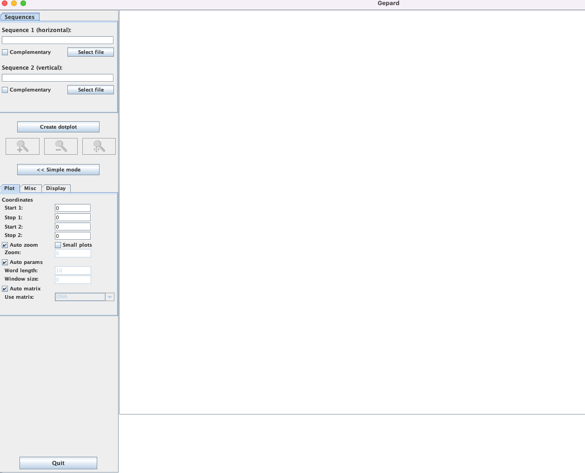
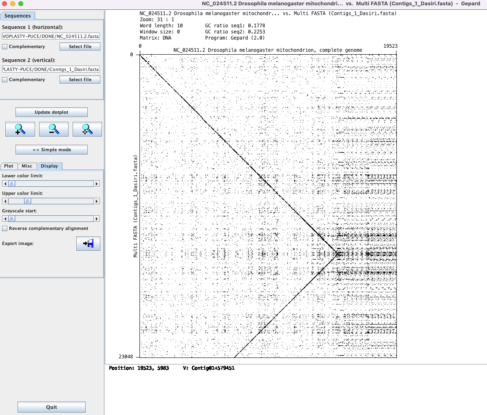
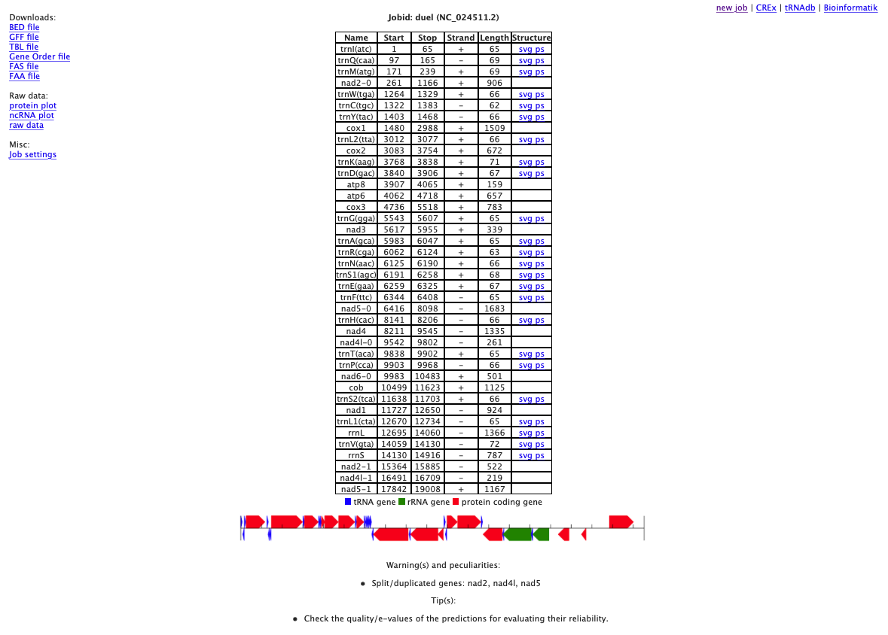

# Ensamblaje de genomas mitocondriales con Novoplasty

El objetivo de este curso práctico es aprender a ensamblar un genoma con secuencias crudas de Illumima (2X150bp). Hemos optado por ensamblar un genoma mitocondrial de _Drosophila_ (de pequeño tamaño ~15 kbb) utilizando archivos de secuencia de ADN total. 

Softwares :
Bowtie2 https://github.com/BenLangmead/bowtie2.    
BBmap https://jgi.doe.gov/data-and-tools/software-tools/bbtools/.    
Novoplasty V4.3 (script perl) https://github.com/ndierckx/NOVOPlasty.    
Emboss http://emboss.sourceforge.net/download/.    
Gepard (java) https://github.com/univieCUBE/gepard.    

Los archivos necesarios :
-Lecturas brutas de Illumina en archivos R1 y R2 --> SRR6399450_R1.fq.gz y SRR6399450_R2.fq.gz (entre otros). 
-Un archivo de configuración https://github.com/ndierckx/NOVOPlasty/blob/master/config.txt con la ruta a los archivos de lectura R1 y R2. 
-Un archivo "Seed" o secuencia de iniciación derivada de una mitochondria de una especie relacionada --> Seed.fasta. 
-Una secuencia de un genoma mitochondrial relacionado (Drosophila melanogaster) -->  NC_024511.2.fasta. 

**ETAPA 1**.  

Se debe descargar los archivos en los computadores como eso: --> "CODE", --> "Download ZIP", --> Unzip la carpeta.  

**ETAPA 2**.  

Las lesturas crudas son accessibles aqui y se deben descargar en los computadores (en la misma carpeta que los archivos de configuracion): https://drive.google.com/drive/folders/1STOlTrA-LZDUILwgparwXvL9jJy-VK2X?usp=sharing.  **Lecturas brutas de Illumina en archivos R1 y R2: 2 archivos con el mismo nombre. No mas**.     

**ETAPA 3**.  

Realización del montaje:
En la carpeta "PUCE-course-April-2022-main".
Todos los pasos necesarios para el montaje se han recogido en el script : CP_assembly.sh

**Para ejecutar el script, los archivos de lectura bruta deben estar previamente concatenados y renombrados como prefix_R1.fq.gz y prefix_R2.fq.gz (donde prefix es el nombre o código del ensamblaje).**  

por ejemplo:


```python
cat SRR6399450_1.fastq.gz > SRR6399450_R1.fq.gz 
cat SRR6399450_2.fastq.gz > SRR6399450_R2.fq.gz 
```

**El archivo de configuración también debe ser renombrado con el prefijo, y debe estar en el mismo directorio que los datos.**.  

Ejemplo:


```python
config_SRR6399450.txt
```

Se puede cambiar la configuration:

**TIPS**: Para conocer la ruta de los archivos en el sistema: 

```python
pwd
```

Editar el archovo de configuracion:  

```python
nano config_SRR6399450.txt
```


```python
Project:
-----------------------
Project name          = SRR6399450 #Cambiar el nombre del proyecto con el acronimo
Type                  = mito
Genome Range          = 12000-23000
K-mer                 = 33
Max memory            = 
Extended log          = 0
Save assembled reads  = no
Seed Input            = /home/**xx**/novoplasty/Seed.fasta #Cambiar la ruta hasta el archivo Seed.fasta
Reference sequence    = /home/**xx**/novoplasty/NC_024511.2.fasta #Cambiar la ruta hasta el archivo NC_024511.2.fasta
Variance detection    = no
Heteroplasmy          = 
HP exclude list       =
Chloroplast sequence  = 

Dataset 1:
-----------------------
Read Length           = 151
Insert size           = 350
Platform              = illumina
Single/Paired         = PE
Combined reads        =
Forward reads         = /home/**xx**/novoplasty/SRR6399450_Cp_dedup.1 #Cambiar la ruta
Reverse reads         = /home/**xx**/novoplasty/SRR6399450_Cp_dedup.2 #Cambiar la ruta

Optional:
-----------------------
Insert size auto      = yes
Insert Range          = 1.8
Insert Range strict   = 1.3
Use Quality Scores    = yes
```

**Se debe copiar el script (CP_assembly.sh) en el mismo directorio ** en el que se encuentran los datos brutos, o en su ruta especificada al llamarlo. 
Es necesario dar como argumento el mismo prefijo utilizado para los datos después de llamar al script.  

El script debe tener los derechos para ser ejecutado como un programa:


```python
chmod 755 CP_assembly.sh
```


```python
./CP_assembly.sh SRR6399450
```

**ETAPA 4**  
Una vez finalizado, el programma puede haber encontrado una o varias opciones para el montaje.  
Si sólo ha encontrado uno, se le cambiará el nombre pro ejemplo: _Circularized_assembly_1_Dasiri.fasta_.  
Si el programa no pudo circularizar el genoma: _Uncircularized_assemblies_1_Dasiri.fasta_.   
Si el programe no pudo tener un genoma completo: _Contigs_1_Dasiri.fasta_.  

**ETAPA 5**. 
El montaje debe comprobarse gráficamente con gepard



Añadir la secuencia 1 (la referencia NC_024511.2.fasta) y 2 (ensamblada con Novoplasty)



**ETAPA 6**  
Dependiendo del resultado del alineamiento gráfico, los contigs ensamblados con Novoplasty pueden ser modificados utilizando las herramientas de EMBOSS como _seqretsplit_ y _extractseq_

**ETAPA 7**. 
El genome puede ser anotado automáticamente usando el sitio web MITOS http://mitos.bioinf.uni-leipzig.de/




```python

```
